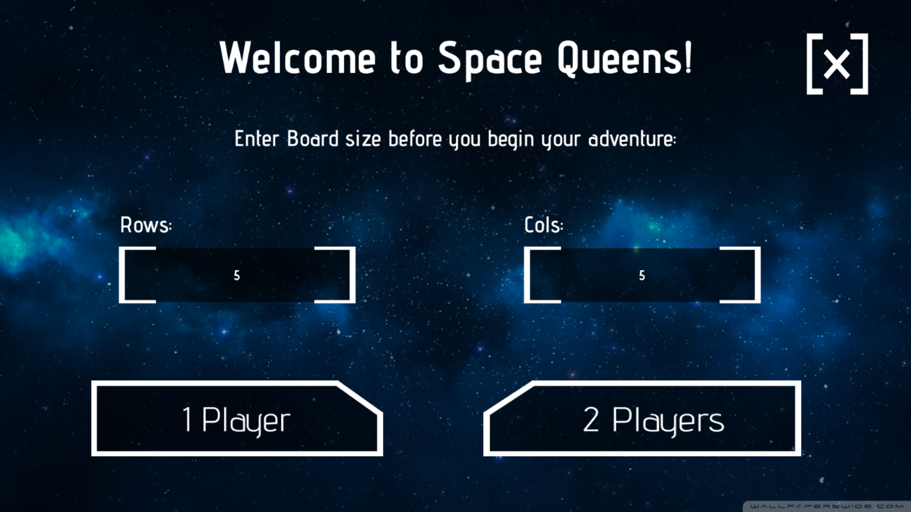
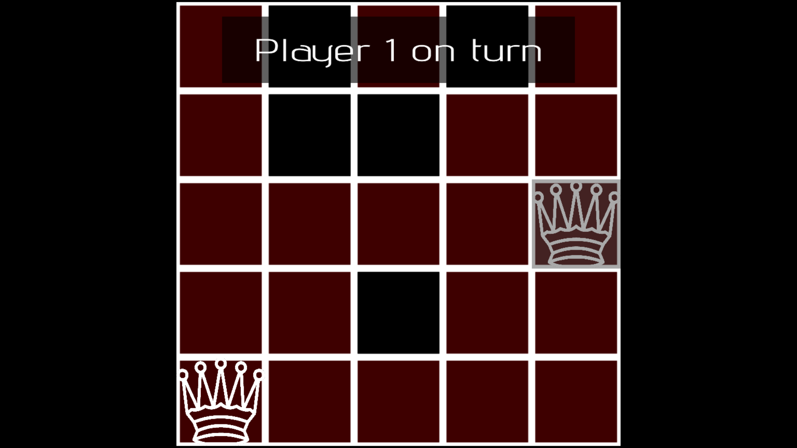

# Queens game

Board game, made for a Game Jam contest by me and my friends. Won 2nd place

Player vs Player or Player vs Bot: Take turn to place queens on a checkboard. Each placed queen blocks the places she can reach (according to chess rules) Be the player to place the last queen on the board to win!

Built in C++ using SDL2.
## 📸 Screenshots

| Menu | Gameplay | Endscreen |
|:----------------------:|:--------------------:| :--------------------:
|  |  |  |

---

## 🛠️ Setup & Run

1. **Clone or download** this repo (ZIP)  
2. **Open** EngineSetUp/Debug  
3. **Run** `EngineSetUp.exe`  
---

## Imporant features
- Utilising the State Design Pattern to control the Game state
- Properly managing textures so they are stored only once using C++ pointers
- 2 bot difficulties - random and algorithmic
